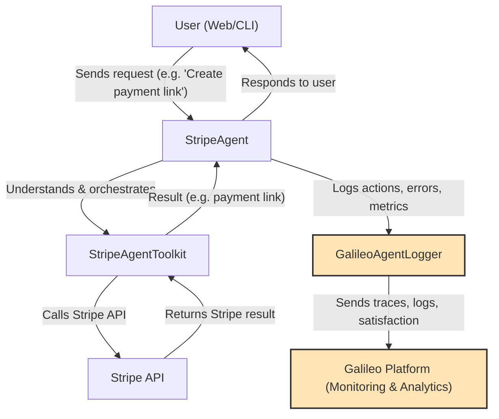

# Galileo's Gizmo Ecommerce Demo - Stripe Agent

🤖 **Galileo's Gizmo** - An intelligent ecommerce AI agent leveraging Galileo's Agent Reliability tools that handles Stripe payments using natural language. Built with TypeScript, powered by OpenAI, and monitored with Galileo.

**What this does:** Talk to Gizmo in plain English like "Create a payment link for my $99 gadget" and it automatically handles all the Stripe API calls, creates products, sets up payments, and logs everything for monitoring in your Galileo dashboard.

## ✨ Features

- 💳 **Natural Language → Stripe API**: "Create a payment link for my tech gadget" → Real Stripe payment link
- 🧠 **AI-Powered**: Uses OpenAI GPT models to understand your requests
- 📊 **Full Monitoring**: Every action logged and analyzed with Galileo
- 🔒 **TypeScript**: Fully typed for reliability and great developer experience
- 🚀 **Production Ready**: Error handling, monitoring, and logging built-in

## 🚀 Quick Start (5 minutes)

### Prerequisites

- **Node.js 18+** - [Download here](https://nodejs.org/)
- **Stripe account** - [Free signup](https://dashboard.stripe.com/register)
- **OpenAI account** - [Get API key](https://platform.openai.com/api-keys) (need ~$5 credit)
- **Galileo account** - [Sign up](https://app.galileo.ai/)

### Installation

1. **Clone and install:**

   ```bash
   git clone https://github.com/erinmikailstaples/stripe-agents.git
   cd stripe-agents
   npm install
   ```

2. **Set up your API keys:**

   ```bash
   cp .env.example .env
   ```

   Edit `.env` with your actual keys:

   ```env
   # Get from https://dashboard.stripe.com/apikeys
   STRIPE_SECRET_KEY=sk_test_your_stripe_secret_key_here
   
   # Get from https://platform.openai.com/api-keys
   OPENAI_API_KEY=sk-your_openai_api_key_here
   
   # Get from Galileo dashboard
   GALILEO_API_KEY=your_galileo_api_key_here
   GALILEO_PROJECT=stripe-agent-demo
   GALILEO_LOG_STREAM=production
   
   # Agent settings
   AGENT_NAME=GizmoEcommerceAgent
   AGENT_DESCRIPTION=Galileo's Gizmo - An AI agent for ecommerce payments and product management
   ```

3. **Choose your experience:**

   **Option A - Web Interface (Recommended):**
   ```bash
   npm run web
   ```
   Then visit `http://localhost:3000` for the space-themed chat interface!
   
   **Option B - Interactive CLI:**
   ```bash
   npm run interactive
   ```
   
   **Option C - Demo with Sample Scenarios:**
   ```bash
   npm run dev
   ```

   🎉 **Success!** You should see the agent ready to help with your Stripe operations!

## 💬 How to Use

### 🌐 Web Interface (Recommended)

The web interface provides a beautiful space-themed chat experience:

```bash
npm run web
# Visit http://localhost:3000
```

**Features:**
- 🚀 **Space-themed UI**: Immersive cosmic design with animations
- 💬 **Real-time Chat**: Beautiful chat interface with message formatting
- 🛠️ **Quick Tools**: Sidebar buttons for common operations
- ✨ **Examples**: Click-to-use example requests
- 📊 **Live Monitoring**: Every interaction logged to Galileo
- 🔄 **Session Management**: Persistent conversation context
- 🛸 **Gizmo Assistant**: Space-themed AI personality

### 🤖 Interactive CLI Mode

The CLI mode provides a real-time terminal chat experience:

```bash
npm run interactive
```

**Features:**
- 💬 **Real-time Chat**: Type your requests and get instant responses
- 🆘 **Built-in Help**: Type `help` for examples and guidance
- 📊 **Live Monitoring**: Every interaction logged to Galileo in real-time
- 🔄 **Session Management**: Continuous conversation with context
- 🛸 **Space-themed Experience**: Immersive Galileo's Gizmos branding

**Example Conversation:**
```
🚀 You: Create a payment link for the Mars Explorer Kit at $199
🌟 Gizmo: I'll create that payment link for you! Setting up the Mars Explorer Kit...
✅ Payment link created: https://buy.stripe.com/test_abc123
🔧 Stripe operations: create_product, create_price, create_payment_link
```

### 📝 Natural Language Examples

Just talk to your agent in natural language! Here are some examples:

### Creating Payment Links

**Input:**
```text
💬 "Create a payment link for my smart gadget 'Gizmo Pro X1' priced at $149"
```

**Agent Actions & Stripe API Evidence:**
```json
{
  "workflow_trace": {
    "session_id": "sess_abc123xyz",
    "steps": [
      {
        "step": 1,
        "action": "stripe.products.create",
        "stripe_response": {
          "id": "prod_NvJvC5NqEQ7XcX",
          "object": "product",
          "name": "Gizmo Pro X1",
          "created": 1642723200
        },
        "status": "success"
      },
      {
        "step": 2,
        "action": "stripe.prices.create", 
        "stripe_response": {
          "id": "price_1KXvJKJvC5NqEQ7X",
          "unit_amount": 14900,
          "currency": "usd",
          "product": "prod_NvJvC5NqEQ7XcX"
        },
        "status": "success"
      },
      {
        "step": 3,
        "action": "stripe.payment_links.create",
        "stripe_response": {
          "id": "plink_1KXvJKJvC5NqEQ7X",
          "url": "https://buy.stripe.com/test_4gw00000000aF2M5kk",
          "active": true,
          "line_items": [{"price": "price_1KXvJKJvC5NqEQ7X", "quantity": 1}]
        },
        "status": "success"
      }
    ]
  }
}
```

**Output:**
```text
🤖 "Created your payment link! I've set up the complete product in Stripe:
   
   ✅ Product: Gizmo Pro X1 (prod_NvJvC5NqEQ7XcX)
   ✅ Price: $149.00 USD (price_1KXvJKJvC5NqEQ7X)  
   ✅ Payment Link: https://buy.stripe.com/test_4gw00000000aF2M5kk
   
   Your customers can now purchase directly through this link!"
```

### Managing Customers

**Input:**
```text
💬 "Add a new customer with email sarah@example.com and name Sarah Wilson"
```

**Agent Actions & Stripe API Evidence:**
```json
{
  "workflow_trace": {
    "session_id": "sess_def456uvw",
    "steps": [
      {
        "step": 1,
        "action": "stripe.customers.create",
        "stripe_response": {
          "id": "cus_NBN8ZzqKcRfJwP",
          "object": "customer",
          "email": "sarah@example.com",
          "name": "Sarah Wilson",
          "created": 1642723300,
          "default_source": null,
          "invoice_prefix": "7D45F5A4"
        },
        "status": "success"
      }
    ]
  }
}
```

**Output:**
```text
🤖 "Customer created successfully in Stripe:
   
   ✅ Customer ID: cus_NBN8ZzqKcRfJwP
   ✅ Name: Sarah Wilson
   ✅ Email: sarah@example.com
   ✅ Created: January 20, 2022
   
   The customer is now ready for orders and subscriptions!"
```

### Subscription Management

**Input:**
```text
💬 "Show me all active subscriptions for customer cus_1234"
```

**Agent Actions & Stripe API Evidence:**
```json
{
  "workflow_trace": {
    "session_id": "sess_ghi789rst",
    "steps": [
      {
        "step": 1,
        "action": "stripe.subscriptions.list",
        "stripe_request": {"customer": "cus_1234", "status": "active"},
        "stripe_response": {
          "object": "list",
          "data": [
            {
              "id": "sub_1KXvJKJvC5NqEQ7X",
              "object": "subscription",
              "status": "active",
              "customer": "cus_1234",
              "current_period_start": 1642723400,
              "current_period_end": 1645315400,
              "items": {
                "data": [{"price": {"nickname": "Pro Plan Monthly"}}]
              }
            }
          ],
          "has_more": false
        },
        "status": "success"
      }
    ]
  }
}
```

**Output:**
```text
🤖 "Found 1 active subscription for customer cus_1234:
   
   ✅ Subscription: sub_1KXvJKJvC5NqEQ7X
   ✅ Plan: Pro Plan Monthly
   ✅ Status: Active
   ✅ Current Period: Jan 20 - Feb 19, 2022
   
   Customer's billing is up to date and subscription is running normally."
```

### What the Agent Can Do

The agent handles these Stripe operations automatically:

- 💳 **Payment Links** - Create links for one-time or recurring payments
- 👥 **Customer Management** - Create, update, and search customers  
- 📦 **Product Catalog** - Create and manage your product offerings
- 💰 **Pricing** - Set up complex pricing structures
- 🔄 **Subscriptions** - Manage recurring billing and subscriptions
- 📄 **Invoicing** - Create and send invoices to customers

### Integration in Your App

```typescript
import { StripeAgent } from './src/agents/StripeAgent';

const agent = new StripeAgent();

// Process any natural language request
const response = await agent.processMessage(
  "Create a payment link for a gadget called 'Gizmo Smart Hub' priced at $99"
);

console.log(response.message); // User-friendly response
console.log(response.data);    // Stripe API response data
```

## 📊 AI Reliability with Galileo

Every interaction is automatically logged and analyzed with Galileo's workflow tools:

### What Gets Tracked

- ⏱️ **Performance** - Response times and execution speed per workflow step
- ✅ **Success Rates** - How often operations complete successfully  
- 🔧 **Tool Usage** - Which Stripe APIs are being called with full request/response logs
- 🐛 **Error Analysis** - Types and patterns of failures with Stripe error codes
- 🎯 **Quality Scores** - How well the agent understands requests
- 📈 **Usage Trends** - Popular operations and user patterns
- 🔄 **Workflow Traces** - End-to-end session tracking from input to Stripe API completion

### Galileo Dashboard - Live Agent Monitoring

See your AI agent's performance in your Galileo dashboard with detailed workflow evidence:

#### Session Workflow Tracking
```json
{
  "session": {
    "id": "sess_abc123xyz",
    "user_input": "Create a payment link for my gadget",
    "workflow_steps": [
      {
        "step_id": "step_1",
        "action": "stripe.products.create",
        "start_time": "2024-01-20T10:00:00Z",
        "end_time": "2024-01-20T10:00:02Z", 
        "duration_ms": 2000,
        "stripe_request": {"name": "Gizmo Pro X1", "type": "good"},
        "stripe_response": {"id": "prod_NvJvC5NqEQ7XcX", "status": "created"},
        "success": true
      },
      {
        "step_id": "step_2", 
        "action": "stripe.payment_links.create",
        "start_time": "2024-01-20T10:00:02Z",
        "end_time": "2024-01-20T10:00:03Z",
        "duration_ms": 1000,
        "stripe_request": {"line_items": [{"price": "price_1KXvJKJvC5NqEQ7X"}]},
        "stripe_response": {"url": "https://buy.stripe.com/test_4gw00000000aF2M5kk"},
        "success": true
      }
    ],
    "total_duration_ms": 3000,
    "stripe_objects_created": ["prod_NvJvC5NqEQ7XcX", "price_1KXvJKJvC5NqEQ7X", "plink_1KXvJKJvC5NqEQ7X"],
    "final_output": "Payment link created successfully"
  }
}
```

#### Dashboard Features
- **Session traces** showing complete conversation flows with Stripe API evidence
- **Tool spans** for each Stripe API call with request/response data
- **Performance metrics** across all interactions with Stripe response times
- **Error tracking** with detailed Stripe error context and recovery actions
- **Quality evaluations** of agent responses with Stripe operation success rates
- **Workflow visualization** showing the complete path from natural language to Stripe objects

### Advanced Workflow Logging

```typescript
import { GalileoLogger } from './src/utils/GalileoLogger';

const logger = new GalileoLogger();

// Start a named workflow session with Stripe operation tracking
await logger.startWorkflowSession('Payment Link Creation', {
  customer_intent: 'create_payment_link',
  expected_stripe_objects: ['product', 'price', 'payment_link']
});

// Log each Stripe API operation with full context
await logger.logStripeOperation('products.create', {
  input: userMessage,
  stripe_request: productCreateRequest,
  stripe_response: productCreateResponse,
  duration_ms: 2000,
  success: true,
  metadata: {
    product_type: 'physical_good',
    price_point: '$149'
  }
});

// Complete the workflow with evidence of success
await logger.completeWorkflow({
  stripe_objects_created: ['prod_123', 'price_456', 'plink_789'],
  total_api_calls: 3,
  user_satisfaction_score: 0.95,
  business_value: 'payment_link_ready_for_customers'
});
```

## 🏗️ Architecture

```
src/
├── agents/
│   └── StripeAgent.ts          # Main agent implementation
├── config/
│   └── environment.ts          # Environment configuration
├── types/
│   └── index.ts               # TypeScript type definitions
├── utils/
│   └── GalileoLogger.ts       # Galileo integration utilities
└── index.ts                   # Main application entry point
```

### Key Components

- **[`StripeAgent.ts`](file:///Users/erinmikail/GitHub-Local/stripe-agents/src/agents/StripeAgent.ts)** - Main agent that processes natural language and calls Stripe APIs
- **[`GalileoLogger.ts`](file:///Users/erinmikail/GitHub-Local/stripe-agents/src/utils/GalileoLogger.ts)** - Handles all monitoring and logging to Galileo
- **[`environment.ts`](file:///Users/erinmikail/GitHub-Local/stripe-agents/src/config/environment.ts)** - Configuration management for API keys and settings
- **[`types/index.ts`](file:///Users/erinmikail/GitHub-Local/stripe-agents/src/types/index.ts)** - TypeScript type definitions for type safety

## 🗺️ Application Flow Diagram

Below is a simplified architecture diagram showing the main flow of your app. **Galileo** is highlighted as the monitoring and analytics layer, capturing every action, error, and user satisfaction event for observability and reliability:



## ⚙️ Configuration

### Customizing Stripe Operations

Edit [`src/agents/StripeAgent.ts`](file:///Users/erinmikail/GitHub-Local/stripe-agents/src/agents/StripeAgent.ts) to enable/disable operations:

```typescript
const stripeToolkit = new StripeAgentToolkit({
  secretKey: env.stripe.secretKey,
  configuration: {
    actions: {
      paymentLinks: { create: true },
      customers: { create: true, list: true },
      products: { create: true, list: true },
      prices: { create: true, list: true },
      invoices: { create: true, finalize: true },
      subscriptions: { list: true, update: true, cancel: true },
    },
  },
});
```

### Changing AI Models

Update [`src/config/environment.ts`](file:///Users/erinmikail/GitHub-Local/stripe-agents/src/config/environment.ts):

```typescript
const llm = new ChatOpenAI({
  openAIApiKey: env.openai.apiKey,
  modelName: 'gpt-4o-mini',  // Options: 'gpt-4', 'gpt-3.5-turbo'
  temperature: 0.1,          // Lower = more consistent responses
});
```

## 🔒 Security & Best Practices

- ✅ **API keys are in `.env`** (automatically ignored by git)
- ✅ **Input validation** on all user requests  
- ✅ **Rate limiting** respects Stripe API limits
- ✅ **Error handling** prevents sensitive data leaks
- ✅ **TypeScript** catches bugs at compile time

## 🚀 Production Deployment

1. **Build for production:**

   ```bash
   npm run build
   npm start
   ```

2. **Optional Docker setup:**

   ```dockerfile
   FROM node:18-alpine
   WORKDIR /app
   COPY package*.json ./
   RUN npm ci --only=production
   COPY dist ./dist
   CMD ["node", "dist/index.js"]
   ```

## 🐛 Troubleshooting

### Common Issues

**❌ "Stripe API key not found"**
- Check your `.env` file has `STRIPE_SECRET_KEY=sk_test_...`
- Ensure key starts with `sk_test_` (not `pk_test_`)

**❌ "OpenAI API quota exceeded"**  
- Add credits at [platform.openai.com](https://platform.openai.com/account/usage)
- Check your usage limits

**❌ "Build fails with TypeScript errors"**
- Run `npm install` to ensure all dependencies
- Check [`tsconfig.json`](file:///Users/erinmikail/GitHub-Local/stripe-agents/tsconfig.json) is correct

### Need Help?

1. Check console error messages for specific issues
2. Verify all API keys are set correctly in `.env`
3. See [SETUP.md](file:///Users/erinmikail/GitHub-Local/stripe-agents/SETUP.md) for detailed setup instructions
4. Check [Stripe Agent documentation](https://github.com/stripe/agent-toolkit) 

## 🛠️ Development Status & Key Components

### Current Status
The Galileo integration is functioning correctly with proper separation of user input and AI output in logs. All components are working together for accurate monitoring and logging.

### Key Files & Their Purpose

#### Core Application Files
- **[`src/utils/GalileoLogger.ts`](file:///Users/erinmikail/GitHub-Local/stripe-agents/src/utils/GalileoLogger.ts)** - Core Galileo logging implementation
  - `logAgentExecution` - Logs user input and agent output separately
  - `addLlmSpan` - Tracks AI model interactions with distinct inputs/outputs
  - `addToolSpan` - Logs Stripe API operations with detailed request/response data
  - `startTrace`, `conclude`, `flush` - Session management methods

- **[`src/agents/StripeAgent.ts`](file:///Users/erinmikail/GitHub-Local/stripe-agents/src/agents/StripeAgent.ts)** - Main agent orchestration
  - `processMessage` - Handles user requests and coordinates Stripe operations
  - `logAgentExecution` - Integration point with GalileoLogger
  - `startGalileoSession`, `logConversationToGalileo`, `concludeGalileoSession` - Session lifecycle

- **[`src/server.ts`](file:///Users/erinmikail/GitHub-Local/stripe-agents/src/server.ts)** - Web server backend
  - `/api/chat` endpoint - Manages web sessions and agent processing
  - Session management - Creates isolated StripeAgent instances per session
  - Shutdown handler - Ensures proper Galileo session conclusion

#### Testing & Verification
- **`test-galileo-fixed.js`** - Galileo integration test script
  - Verifies input/output separation in logs
  - Tests session creation and conclusion
  - Confirms proper trace logging to Galileo dashboard

### Essential Commands

#### Running the Application
- **`npm run web`** - Start web interface at http://localhost:3000
- **`npm run interactive`** - Start CLI interface for terminal interaction
- **`npm run dev`** - Run demo with sample scenarios

#### Testing & Verification
- **`node test-galileo-fixed.js`** - Test Galileo logging functionality
- **`npm run build`** - Build for production deployment
- **`npm run start`** - Start production server

### Verification Steps
1. **Check Galileo Dashboard** - Verify traces show distinct user inputs and agent outputs
2. **Test Web Interface** - Ensure sessionId handling and UI updates work correctly
3. **Test CLI Interface** - Confirm real-time logging and conversation context
4. **Monitor Logs** - Verify proper separation of input/output in Galileo traces

### Next Steps for Enhancement
- **Granular Logging** - Add more detailed Stripe API request/response logging in `addToolSpan` method
- **Frontend Integration** - Ensure `callAgent` method properly handles sessionId and connection status
- **Error Tracking** - Enhanced error context logging for better debugging

## 📚 Learn More

- **[Stripe Agent Toolkit](https://github.com/stripe/agent-toolkit)** - Official Stripe agent tools
- **[Stripe API Docs](https://stripe.com/docs/api)** - Complete API reference
- **[OpenAI API Docs](https://platform.openai.com/docs)** - OpenAI API documentation  
- **[Galileo Docs](https://v2docs.galileo.ai/what-is-galileo)** - Galileo documentation.

---

Built with ❤️ using TypeScript, Stripe Agent Toolkit, OpenAI, and Galileo Agent Reliability.