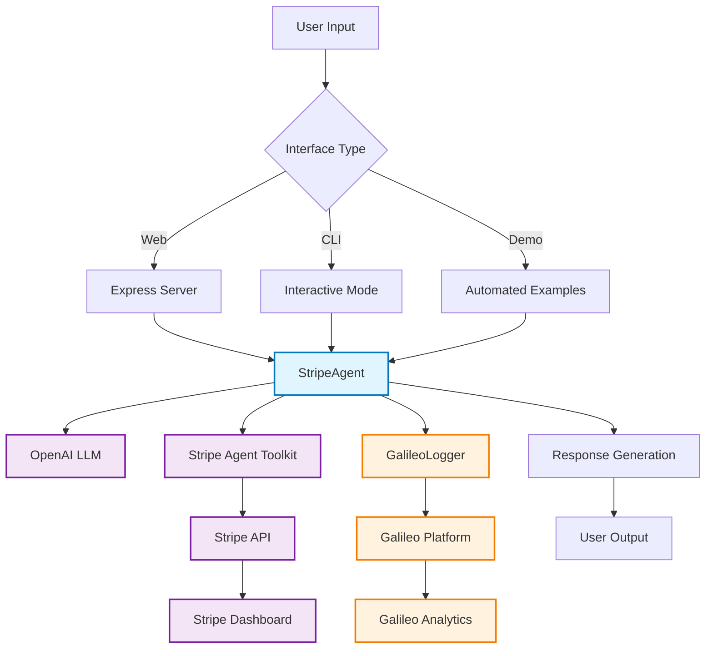

# Stripe Agents Demo - Galileo's Gizmos Space Commerce

🚀 **Galileo's Gizmos** - An intelligent AI-powered ecommerce assistant that handles Stripe payments using natural language. Built with TypeScript, powered by OpenAI, and monitored with Galileo Agent Reliability.

## 🌟 What is the Stripe Agents Demo?

This demo showcases a conversational AI agent that can understand natural language requests and automatically perform Stripe operations. Just say "Create a payment link for my Space Telescope at $299" and the agent will:

- ✅ Create a Stripe product
- ✅ Set up pricing 
- ✅ Generate a payment link
- ✅ Monitor the entire process with Galileo
- ✅ Provide you with a ready-to-share checkout URL

### Key Features

- 💬 **Natural Language Processing**: Talk to your payments system in plain English
- 🔧 **Full Stripe Integration**: Products, customers, subscriptions, invoices, and more
- 📊 **AI Reliability Monitoring**: Every interaction logged and analyzed with Galileo
- 🌐 **Multiple Interfaces**: Web UI, CLI, and programmatic API
- 🛡️ **Anti-Loop Protection**: Advanced cycle detection prevents infinite tool usage
- 🚀 **Space-Themed Experience**: Immersive cosmic commerce interface

## 🚀 Quick Start

### Prerequisites

Before starting, make sure you have:
- **Node.js 18+** - [Download here](https://nodejs.org/)
- **Stripe account** - [Free signup](https://dashboard.stripe.com/register)
- **OpenAI account** - [Get API key](https://platform.openai.com/api-keys) (need ~$5 credit)
- **Galileo account** - [Sign up](https://app.galileo.ai/) (free for developers)

### Installation

1. **Clone and install dependencies:**
   ```bash
   git clone <repository-url>
   cd stripe-agents
   npm install
   ```

2. **Set up environment variables:**
   ```bash
   cp .env.example .env
   ```

   Edit `.env` with your actual API keys:
   ```env
   # Stripe Configuration
   STRIPE_SECRET_KEY=sk_test_your_stripe_secret_key_here
   
   # OpenAI Configuration
   OPENAI_API_KEY=sk-your_openai_api_key_here
   
   # Galileo Configuration
   GALILEO_API_KEY=your_galileo_api_key_here
   GALILEO_PROJECT=stripe-agent-demo
   GALILEO_LOG_STREAM=production
   
   # Agent Configuration
   AGENT_NAME=GizmoEcommerceAgent
   AGENT_DESCRIPTION=Galileo's Gizmo - An AI agent for ecommerce payments and product management
   ```

3. **Build and run:**
   ```bash
   npm run build
   ```

### Choose Your Experience

#### 🌐 Web Interface (Recommended)
```bash
npm run web
```
Visit `http://localhost:3000` for the space-themed chat interface!

#### 💻 Interactive CLI
```bash
npm run interactive
```
Real-time terminal chat with your AI assistant.

#### 🤖 Demo Mode
```bash
npm run dev
```
Runs automated examples to see the agent in action.

## 🔧 Environment Variables

| Variable | Description | Required | Example |
|----------|-------------|----------|---------|
| `STRIPE_SECRET_KEY` | Your Stripe secret key (starts with `sk_test_`) | ✅ | `sk_test_abc123...` |
| `OPENAI_API_KEY` | OpenAI API key for AI processing | ✅ | `sk-abc123...` |
| `GALILEO_API_KEY` | Galileo API key for monitoring | ✅ | `your_galileo_key` |
| `GALILEO_PROJECT` | Galileo project name | ✅ | `stripe-agent-demo` |
| `GALILEO_LOG_STREAM` | Galileo log stream name | ✅ | `production` |
| `AGENT_NAME` | Display name for your agent | ❌ | `GizmoEcommerceAgent` |
| `AGENT_DESCRIPTION` | Agent description | ❌ | `AI assistant for payments` |

## 📦 Available npm Scripts

| Script | Description | Use Case |
|--------|-------------|----------|
| `npm run build` | Compile TypeScript to JavaScript | Production deployment |
| `npm run start` | Start the compiled application | Production server |
| `npm run dev` | Run demo with sample scenarios | Testing and exploration |
| `npm run interactive` | Start interactive CLI mode | Real-time terminal chat |
| `npm run customer-service` | Alias for interactive mode | Customer service simulation |
| `npm run web` | Start web server with UI | Web-based interface |
| `npm run web:build` | Build and start web server | Production web deployment |
| `npm test` | Run test suite | Development and CI/CD |

## 🏗️ Architecture

```
src/
├── agents/
│   └── StripeAgent.ts          # Main agent with cycle detection
├── config/
│   └── environment.ts          # Environment configuration
├── errors/
│   └── CircularToolError.ts    # Custom error handling
├── types/
│   ├── index.ts               # TypeScript definitions
│   └── galileo.d.ts           # Galileo type definitions
├── utils/
│   └── GalileoLogger.ts       # Galileo integration
├── interactive.ts             # CLI interface
├── server.ts                  # Web server and API
└── index.ts                   # Demo mode entry point

public/
├── index.html                 # Web interface
└── app.js                     # Frontend JavaScript

tests/
├── agent.spec.ts              # Comprehensive test suite
├── setup.ts                   # Test configuration
└── test-*.js                  # Individual test files
```

### Key Components

- **[`StripeAgent.ts`](src/agents/StripeAgent.ts)** - Core agent with anti-loop protection and Stripe integration
- **[`GalileoLogger.ts`](src/utils/GalileoLogger.ts)** - Handles monitoring and logging to Galileo platform
- **[`server.ts`](src/server.ts)** - Express.js web server with chat API endpoints
- **[`interactive.ts`](src/interactive.ts)** - CLI interface for terminal-based conversations
- **[`environment.ts`](src/config/environment.ts)** - Configuration management and validation

## 🎯 Architecture Diagram



## 💬 How to Use

### 🌐 Web Interface (Recommended)

The web interface provides a beautiful space-themed chat experience:

```bash
npm run web
# Visit http://localhost:3000
```

**Features:**
- 🚀 **Space-themed UI**: Immersive cosmic design with animations
- 💬 **Real-time Chat**: Beautiful chat interface with message formatting
- 🛠️ **Quick Tools**: Sidebar buttons for common operations
- ✨ **Examples**: Click-to-use example requests
- 📊 **Live Monitoring**: Every interaction logged to Galileo
- 🔄 **Session Management**: Persistent conversation context

### 🤖 Interactive CLI Mode

The CLI mode provides a real-time terminal chat experience:

```bash
npm run interactive
```

**Features:**
- 💬 **Real-time Chat**: Type your requests and get instant responses
- 🆘 **Built-in Help**: Type `help` for examples and guidance
- 📊 **Live Monitoring**: Every interaction logged to Galileo in real-time
- 🔄 **Session Management**: Continuous conversation with context
- 🛸 **Space-themed Experience**: Immersive Galileo's Gizmos branding

### 📝 Natural Language Examples

Just talk to your agent in natural language! Here are some examples:

```text
"Create a payment link for my smart gadget 'Gizmo Pro X1' priced at $149"
"Add a new customer with email sarah@example.com and name Sarah Wilson"
"Show me all active subscriptions for customer cus_1234"
"Create a monthly subscription product called 'Premium Plan' for $29.99"
"List all products in my Stripe account"
```

### What the Agent Can Do

The agent handles these Stripe operations automatically:

- 💳 **Payment Links** - Create links for one-time or recurring payments
- 👥 **Customer Management** - Create, update, and search customers  
- 📦 **Product Catalog** - Create and manage your product offerings
- 💰 **Pricing** - Set up complex pricing structures
- 🔄 **Subscriptions** - Manage recurring billing and subscriptions
- 📄 **Invoicing** - Create and send invoices to customers

## 🔧 Troubleshooting & FAQ

### Common Issues

#### ❌ "Stripe API key not found" or "Invalid API key"
**Solution:**
- Verify your `.env` file contains `STRIPE_SECRET_KEY=sk_test_...`
- Ensure the key starts with `sk_test_` (not `pk_test_`)
- Check that the key has no extra spaces or quotes

#### ❌ "OpenAI API quota exceeded" or "Insufficient credits"
**Solution:**
- Add credits at [OpenAI Platform](https://platform.openai.com/account/usage)
- Verify your OpenAI API key is correct
- Check your API usage limits and billing

#### ❌ "Build fails with TypeScript errors"
**Solution:**
```bash
# Clean and reinstall dependencies
rm -rf node_modules package-lock.json
npm install

# Check TypeScript configuration
npx tsc --noEmit

# Build project
npm run build
```

#### ❌ "Port 3000 already in use"
**Solution:**
```bash
# Kill process using port 3000
lsof -ti:3000 | xargs kill -9

# Or use a different port
PORT=3001 npm run web
```

#### ❌ "Galileo connection failed"
**Solution:**
- Verify your Galileo API key is correct
- Check that `GALILEO_PROJECT` exists in your Galileo dashboard
- Ensure your Galileo account has sufficient quota

### Performance Issues

#### 🐌 "Agent responses are slow"
**Solutions:**
- Use `gpt-4o-mini` instead of `gpt-4` for faster responses
- Reduce conversation history in [`StripeAgent.ts`](src/agents/StripeAgent.ts)
- Check your OpenAI API rate limits

#### 📊 "Galileo logging is delayed"
**Solutions:**
- Increase batch size in [`GalileoLogger.ts`](src/utils/GalileoLogger.ts)
- Check your network connection to Galileo
- Verify Galileo service status

### Development Questions

#### ❓ "How do I add new Stripe operations?"
Edit [`src/agents/StripeAgent.ts`](src/agents/StripeAgent.ts) and enable/disable actions:
```typescript
const stripeToolkit = new StripeAgentToolkit({
  secretKey: env.stripe.secretKey,
  configuration: {
    actions: {
      paymentLinks: { create: true },
      products: { create: true, list: true },
      // Add more operations here
    },
  },
});
```

#### ❓ "How do I customize the AI model?"
Update [`src/config/environment.ts`](src/config/environment.ts):
```typescript
const llm = new ChatOpenAI({
  modelName: 'gpt-4o-mini',  // or 'gpt-4', 'gpt-3.5-turbo'
  temperature: 0.1,          // Lower = more consistent
});
```

#### ❓ "How do I add custom monitoring?"
Extend [`src/utils/GalileoLogger.ts`](src/utils/GalileoLogger.ts):
```typescript
await logger.logCustomEvent('payment_link_created', {
  product_id: productId,
  amount: price,
  customer_segment: 'premium'
});
```

### Testing

#### 🧪 "How do I run tests?"
```bash
# Run all tests
npm test

# Run specific test file
npm test -- --testNamePattern="StripeAgent"

# Run tests with coverage
npm test -- --coverage
```

#### 🔍 "How do I debug failing tests?"
```bash
# Run tests in verbose mode
npm test -- --verbose

# Run tests with debugging
node --inspect-brk node_modules/.bin/jest --runInBand
```

### Advanced Features

#### 🛡️ Anti-Loop Protection

The agent includes an atomic helper tool `get_price_and_create_payment_link` that prevents LLM loops by combining multiple Stripe operations into a single, efficient call:

```typescript
// Helper tool contract
type HelperToolInput = {
  product_name: string;  // Exact product name to search for
  quantity: number;      // Number of items to purchase
};

type HelperToolOutput = string; // Direct payment link URL

// Example usage:
const paymentUrl = await get_price_and_create_payment_link({
  product_name: "Space Telescope",
  quantity: 1
});
// Returns: "https://buy.stripe.com/test_abc123"
```

#### 🔄 Cycle Detection Guard

The agent monitors tool usage patterns and automatically detects circular invocations:

```typescript
// Detects patterns like:
// list_products → list_prices → list_products → list_prices
// and throws CircularToolError with graceful recovery

class CircularToolError extends Error {
  constructor(message: string, public readonly toolPattern: string[]) {
    super(message);
    this.name = 'CircularToolError';
  }
}
```

**Protection features:**
- Monitors the last 4 tool calls for repeating patterns
- Gracefully recovers with helpful error messages
- Logs cycle detection events to Galileo for monitoring
- Prevents infinite loops that could consume API quotas

### 📊 AI Reliability with Galileo

Every interaction is automatically logged and analyzed with Galileo's workflow tools:

#### What Gets Tracked

- ⏱️ **Performance** - Response times and execution speed per workflow step
- ✅ **Success Rates** - How often operations complete successfully  
- 🔧 **Tool Usage** - Which Stripe APIs are being called with full request/response logs
- 🐛 **Error Analysis** - Types and patterns of failures with Stripe error codes
- 🎯 **Quality Scores** - How well the agent understands requests
- 📈 **Usage Trends** - Popular operations and user patterns
- 🔄 **Workflow Traces** - End-to-end session tracking from input to Stripe API completion

#### Dashboard Features
- **Session traces** showing complete conversation flows with Stripe API evidence
- **Tool spans** for each Stripe API call with request/response data
- **Performance metrics** across all interactions with Stripe response times
- **Error tracking** with detailed Stripe error context and recovery actions
- **Quality evaluations** of agent responses with Stripe operation success rates
- **Workflow visualization** showing the complete path from natural language to Stripe objects

### Need More Help?

1. **Check the console logs** - Most issues show detailed error messages
2. **Verify all environment variables** - Use `npm run dev` to test your setup
3. **Review the documentation**:
   - [Stripe Agent Toolkit](https://github.com/stripe/agent-toolkit)
   - [Stripe API Docs](https://stripe.com/docs/api)
   - [Galileo Documentation](https://docs.galileo.ai)
4. **Test with minimal examples** - Use the interactive CLI to debug specific operations
5. **Check your API quotas** - Ensure you have sufficient credits/limits on all services

## 🧪 Testing

The agent includes a comprehensive test suite that validates reliability features:

### Running Tests

```bash
# Run all tests
npm test

# Run tests in watch mode
npm run test:watch

# Run tests with coverage
npm run test:coverage
```

### Test Coverage

**Loop Prevention Tests:**
- ✅ Atomic helper tool prevents multiple API calls
- ✅ Each Stripe primitive called exactly once
- ✅ Handles multiple products without duplication
- ✅ Graceful error handling for missing products

**Cycle Detection Tests:**
- ✅ Detects circular tool usage patterns
- ✅ Throws `CircularToolError` with pattern information
- ✅ Provides graceful recovery messages
- ✅ Logs cycle events to Galileo

**TypeScript Compilation Tests:**
- ✅ Clean compilation without errors
- ✅ Type safety validation
- ✅ Output file generation verification

**Conversation Flow Tests:**
- ✅ Maintains conversation history
- ✅ Session management
- ✅ Context preservation across interactions

## 🔒 Security & Best Practices

- ✅ **API keys are in `.env`** (automatically ignored by git)
- ✅ **Input validation** on all user requests  
- ✅ **Rate limiting** respects Stripe API limits
- ✅ **Error handling** prevents sensitive data leaks
- ✅ **TypeScript** catches bugs at compile time

## 🚀 Production Deployment

1. **Build for production:**

   ```bash
   npm run build
   npm start
   ```

2. **Optional Docker setup:**

   ```dockerfile
   FROM node:18-alpine
   WORKDIR /app
   COPY package*.json ./
   RUN npm ci --only=production
   COPY dist ./dist
   COPY public ./public
   CMD ["node", "dist/index.js"]
   ```

## 📚 Learn More

- **[Stripe Agent Toolkit](https://github.com/stripe/agent-toolkit)** - Official Stripe agent tools
- **[Stripe API Docs](https://stripe.com/docs/api)** - Complete API reference
- **[OpenAI API Docs](https://platform.openai.com/docs)** - OpenAI API documentation  
- **[Galileo Docs](https://docs.galileo.ai)** - Galileo documentation
- **[LangChain Docs](https://js.langchain.com/)** - LangChain framework documentation

---

🚀 **Ready to Launch?** Run `npm run web` and visit `http://localhost:3000` to start your cosmic commerce journey!

Built with ❤️ using TypeScript, Stripe Agent Toolkit, OpenAI, and Galileo Agent Reliability.
